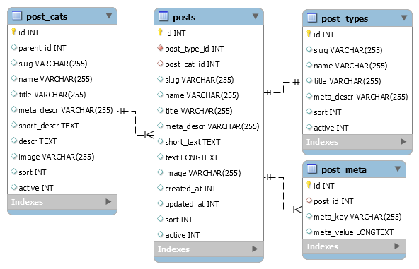

# Posts Module
Module for different type of post, like articles, news, blog post etc.

## Dependencies
```php
    use \kartik\switchinput\SwitchInput;
    use mihaildev\ckeditor\CKEditor;
    use mihaildev\elfinder\ElFinder;
    
```
	"porcelanosa/yii2-toggle-column": "dev-master",
        
## Installation

#### 1. Run composer 
```cmd
composer require porcelanosa/yii2-posts
```
#### 2. Common config 
Add to _'common/config/main.php'_ 
```php
 
    ......
    'modules' => [
        'posts' => [
            'class' => 'porcelanosa\posts\Module',
        ],
    ],
    ......
```
#### 3. Backend config 
Add to _'backend/config/main.php_
```php
'module' => [
    ...
    'posts' => [
        'class'  => 'porcelanosa\posts\Module',
            'controllerMap' => [
                'cpposts' => [
                    'class'     => 'porcelanosa\posts\controllers\AdminController',
                    'as access' => [
                        'class' => \yii\filters\AccessControl::className(),
                        'rules' => [
                            [
                                'allow' => true,
                                'roles' => ['admin'],
                                ],
                            ],
                        ],
                    ],
                ],
            ],
    ...
```
If you rename CintrollerMap name from 'cpposts' you must rename _'modules/posts/views/cppost/'_ folder also.

#### 4. Migration 
Run migration
```
yii migrate --migrationPath=@vendor/porcelanosa/yii2-posts/migrations
```
#### 5. Routes 
Add rules to UrlManager
For example,  
```php
// posts with post_types 'articles'
[
    'pattern' => 'articles',
    'route' => 'posts/default/index',
    'defaults' => ['post_type_slug' => 'articles'],
],
[
    'pattern' => 'articles/<cat_slug>/<slug>',
    'route' => 'posts/default/view',
    'defaults' => ['post_type_slug' => 'articles'],
],
// posts with post_types 'news'
[
    'pattern' => 'news',
    'route' => 'posts/default/index',
    'defaults' => ['post_type_slug' => 'news'],
],
[
    'pattern' => 'news/<cat_slug>/<slug>',
    'route' => 'posts/default/view',
    'defaults' => ['post_type_slug' => 'news'],
],
//'confirm-order' => 'cart/confirmorder',
// Posts
[
    'pattern' => 'posts/<post_type_slug>/<cat_slug>/<slug>',
    'route' => 'posts/default/view'
],
[
    'pattern' => 'posts/<post_type_slug>/<cat_slug>',
    'route' => 'posts/default/catview'
],
[
    'pattern' => 'posts/<post_type_slug>',
    'route' => 'posts/default/index'
],
```
or different for route to _'posts/default/view'_